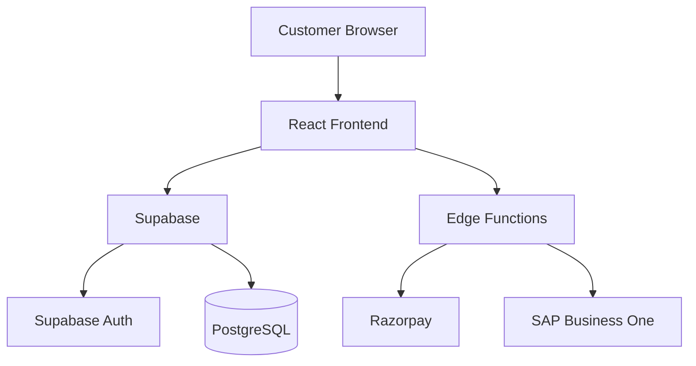

# ELA Website Architecture

## 1. System Overview
The ELA website is a modern e-commerce application built for selling apparel. It separates the frontend presentation layer from the backend database, authentication, and external integrations (payments via Razorpay, ERP via SAP Business One).

## 2. Technology Stack
- **Frontend Framework:** React (18.3) with Vite
- **Language:** TypeScript
- **Styling:** Tailwind CSS, shadcn/ui, Radix UI primitives
- **Routing:** React Router DOM (v6)
- **State Management:** React Context (AuthContext, CartContext), TanStack React Query (v5)
- **Backend/Database:** Supabase (PostgreSQL, Supabase Auth, Edge Functions)
- **Payment Gateway:** Razorpay
- **ERP Integration:** SAP Business One (Service Layer OData API)

## 3. Frontend Architecture
The frontend architecture follows a standard React SPA pattern.

React
↓
Pages (`src/pages/*` - e.g., Shop, ProductDetail, Checkout, Cart)
↓
Components (`src/components/*` - e.g., ProductCard, PaymentModal)
↓
Context/Hooks (`src/context/*`, `src/hooks/*` - AuthContext, CartContext)
↓
Services (`src/integrations/supabase/client.ts`)
↓
Supabase

## 4. Backend Architecture
The backend is entirely managed by Supabase, combining managed database services with serverless computing.

React Frontend
↓
Supabase
├── Authentication (Email/Password via Supabase Auth)
├── PostgreSQL Database
├── RLS (Row Level Security restricting data access)
└── Edge Functions (`create-cod-order`, `create-razorpay-order`, `verify-razorpay-payment`, `razorpay-webhook`, `sap-connection-test`)

## 5. Database Architecture
The database is hosted on Supabase PostgreSQL.

**Tables:**
- `profiles`: User profiles linked to `auth.users` (id, email, full_name, created_at, updated_at).
- `user_roles`: Role management (`admin`, `user`) linked to `auth.users`.
- `funnel_events`: Tracking user actions (signup, add_to_cart, checkout_started, etc.).
- `orders`: E-commerce orders (id, user_id, total_amount, status, shipping_address, payment_status, razorpay_order_id, razorpay_payment_id, payment_method).
- `order_items`: Line items for orders (id, order_id, product_id, product_name, quantity, price, size, color).

**Relationships:**
- `profiles.id` references `auth.users(id)`
- `user_roles.user_id` references `auth.users(id)`
- `orders.user_id` references `auth.users(id)`
- `order_items.order_id` references `orders(id)`

**RLS Policies:**
- Row Level Security is enabled on all tables.
- Users can view and update their own `profiles`.
- Users can insert and view their own `orders` and `order_items`.
- Admin users (checked via `public.has_role`) have extended privileges to view/update all orders and user profiles.

## 6. Authentication Flow
- User signs up or logs in using Supabase Auth (handled in `Auth.tsx`).
- A PostgreSQL database trigger (`on_auth_user_created`) automatically provisions a record in the `profiles` and `user_roles` tables for new signups.
- The React application maintains session state via `AuthContext`.
- Authenticated requests to Supabase automatically carry the user's JWT, which is evaluated by RLS policies.

## 7. Payment Flow
The payment flow supports two methods: Razorpay and Cash on Delivery (COD).
- **Razorpay Flow:** User initiates checkout -> React calls `create-razorpay-order` Edge Function -> Function returns a Razorpay Order ID -> React mounts Razorpay Checkout widget -> Upon success, React calls `verify-razorpay-payment` Edge Function to validate the signature and update the order status in PostgreSQL.
- **COD Flow:** User initiates checkout -> React calls `create-cod-order` Edge Function -> Function creates a pending order directly in PostgreSQL and returns success.
- **Webhooks:** A `razorpay-webhook` Edge Function is available for asynchronous payment status updates.

## 8. Order Flow
Product (viewing items from local catalog)
→ Cart (items stored in local state via `CartContext`)
→ Checkout (gathering shipping details)
→ Payment (Razorpay/COD selection via Edge Functions)
→ Order (record created in `orders` and `order_items` tables)
→ Order Confirmation (success page displayed to user)
→ Track Order (users can view their order status)

## 9. SAP Integration
The ELA backend implements an integration layer to synchronize product data from SAP Business One.

ELA Edge Function (`sap-connection-test` / future sync)
↓
`_shared/sap.ts` (SAP Service Layer Client handling login, B1SESSION cookies, and OData fetching)
↓
`_shared/sap-products.ts` (Service layer mapping SAP items to ELA formats)
↓
SAP Service Layer (`/b1s/v2/Items`)

**Current Limitation:** The SAP internal endpoint (`sapserver:50000` or `localhost:50000`) is a private network address and is not currently reachable from the public Supabase Edge Function environment.

## 10. Environment Variables
- `SUPABASE_URL`
- `SUPABASE_ANON_KEY`
- `RAZORPAY_KEY_ID`
- `RAZORPAY_KEY_SECRET`
- `RAZORPAY_WEBHOOK_SECRET`
- `SAP_SERVICE_LAYER_URL`
- `SAP_COMPANY_DB`
- `SAP_USERNAME`
- `SAP_PASSWORD`
- `SAP_HTTP_TIMEOUT`
- `SAP_DEFAULT_PRICE_LIST`
- `SAP_DEFAULT_WAREHOUSE`

## 11. Deployment Architecture
Browser (React SPA built with Vite)
↓
Static Hosting (Netlify / Vercel / Lovable)
↓
Supabase (BaaS)
↓
PostgreSQL Database / Deno Edge Functions

## 12. Security Architecture
- **Frontend/Backend Separation:** The React frontend interacts only with the Supabase API and Edge Functions. It does not connect directly to the database or external APIs (like SAP or Razorpay secrets).
- **Row Level Security (RLS):** Database queries are securely scoped to the authenticated user's ID via the JWT.
- **Secret Handling:** All third-party credentials (Razorpay secret, SAP password) are stored exclusively in the Supabase server-side environment variables and are never shipped in the client bundle.
- **Edge Functions:** Business logic involving secrets (like payment signature verification and SAP authentication) happens securely inside isolated serverless Deno environments.

## 13. Current Limitations / Blockers
- **SAP Network Connectivity:** The SAP Business One Service Layer is hosted on a private, internal company network. It is physically blocked from access by the public-facing Supabase Edge Functions. A secure network bridge (such as a Cloudflare Tunnel) is required to establish this connection.
- **Product Catalog Disconnect:** Because SAP connectivity is blocked, the frontend remains temporarily hardcoded (`src/data/products.ts`) until live synchronization can be proven and deployed.

---

## Architecture Diagram

